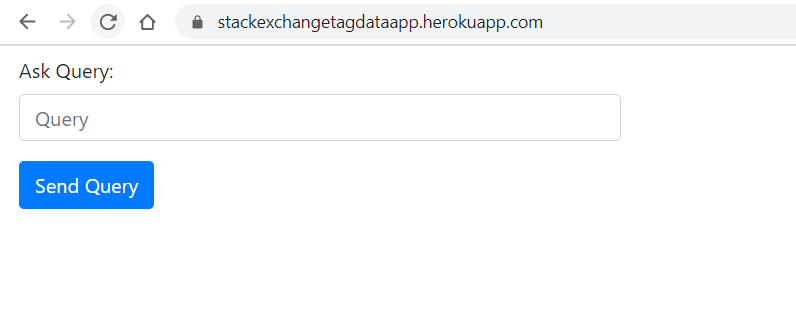
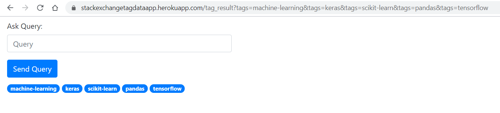

# Description
This is a small app which takes data from <a href="https://api.stackexchange.com/2.2/questions?page=1&pagesize=100&order=desc&sort=activity&site=datascience">Stack Exchange API</a>.
In this app I extracted the tags used in various questions and create a weighted graph from it and then querying for the with words like For Eg. Python.
This app returns top 5 associated tags with this query. 
This App is deployed on the below URL: 
<a href="https://stackexchangetagdataapp.herokuapp.com/"> Heroku App </a> Check it out!

## Screenshots:

### 1. Home Page

### 2. Result Page

